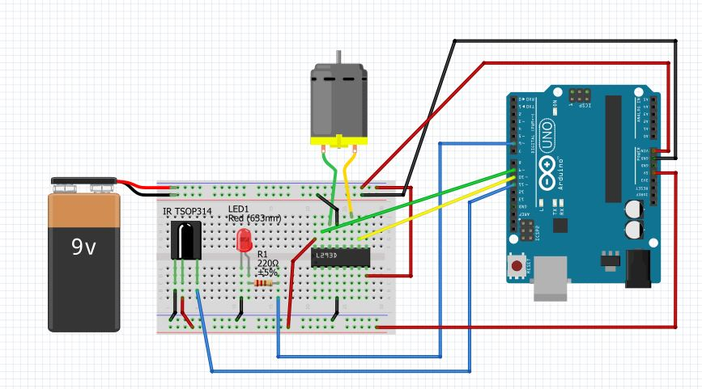

# IR Remote Controlled Password Lock
Circuit is as shown.

Connect the motor to your door latch. You can also use a servo instead of a motor+motor driver.
To get the button values for your IR remote , use the IRremote_test code and change the b array in the main code with corresponding values.
The password can only be numerical but of any length. 
To set your password change the pw variable. Run the IR_REMOTE_CONTROL_LOCK code(main program).
I used the 0-9 buttons on my remote to type passwords. To open the lock press the password and the open button(I used the power button on my remote) to open the lock. If it password pressed is right the led will glow for a quarter of a second and the lock must open. You can also have a reset button if at any time you want to reset the password while typing it.
To close the lock you can press the close button(assign any button on your remote).
If you do not want to have a password lock you can use the VERY_SIMPLE_IR_LOCK code that just opens and closes with the press of a button.
This is a very primitive version of the lock. Feel free to experiment with the code and the circuit.
